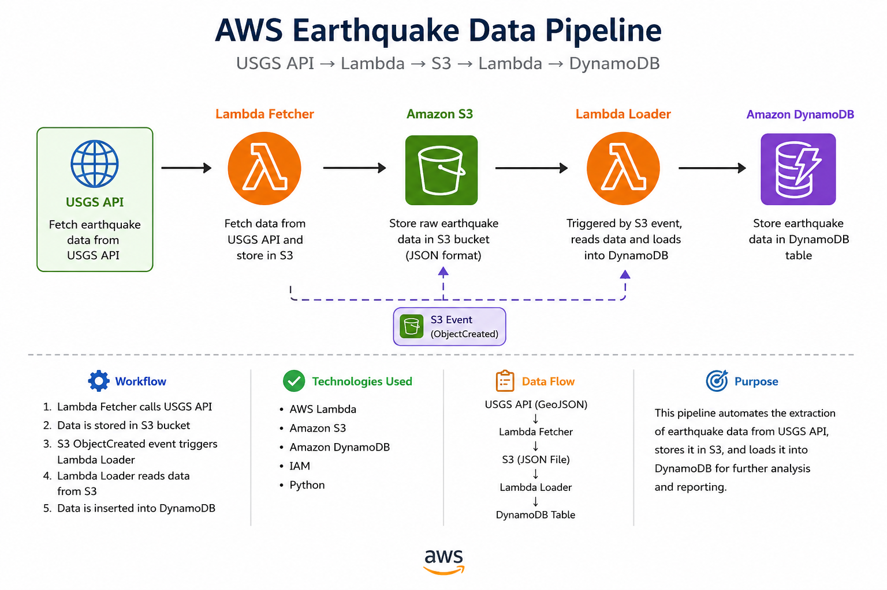

# AWS Earthquake Data Pipeline

## Architecture

USGS API
↓
Lambda Fetcher
↓
Amazon S3
↓
Lambda Loader
↓
Amazon DynamoDB

## AWS Services Used

- AWS Lambda
- Amazon S3
- Amazon DynamoDB
- IAM

## Workflow

1. Lambda Fetcher calls the USGS API.
2. Earthquake data is stored in S3.
3. S3 ObjectCreated event triggers Lambda Loader.
4. Lambda Loader reads JSON data from S3.
5. Data is inserted into DynamoDB.

## Status

Completed Successfully
